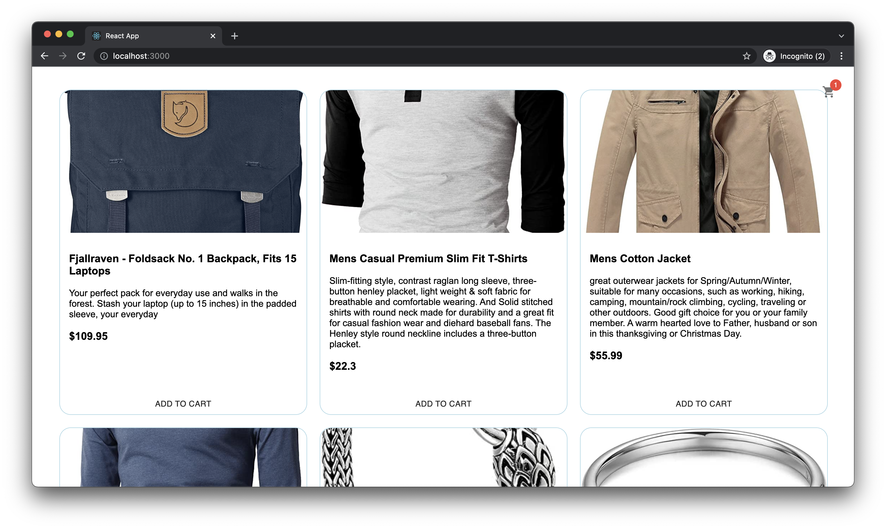

# Title

Description

| \                | \                                                                                                                                                                      |
|------------------|------------------------------------------------------------------------------------------------------------------------------------------------------------------------|
| Deploy status	         | \ |
| Deploy preview   | \                                                                                                                                              |
| Project typology | Personal/Step by step from tutorial                                                                                                                                                               |



## 🔥 Tech stack

| Purpose               | Technology   |
|:-----------------------|:--------------|
| Templating            | TypeScript      |
| Framework            | React      |
| Styling               | Styled components |
| Documentation         | Markdown     |

## 🌊 Run development mode

```shell
# install dependencies
npm i

# serve with hot reload at localhost:8080
npm start
```

## 🧳 Build setup

```shell
# build for production
npm run build
```

### 🌿 Branches

| Branch name           | Use           |
|:----------------------|:--------------|
| `main`                | main    |
